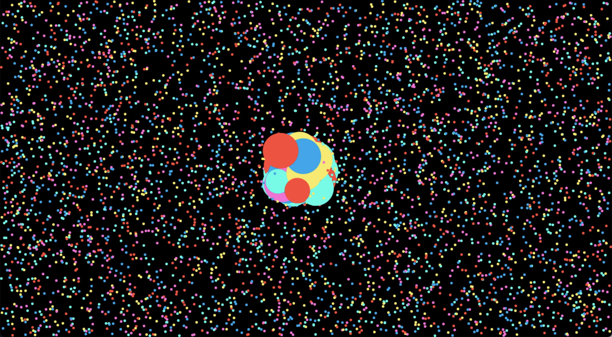

# Interactive Circles

View it here: https://dimitrigol.github.io/First-Canvas-Project/

## About the canvas:
* There are a certain amount of circles
* They bounce around the screen
* The circles grow in size if the mouse hovers over them
* When the screen resizes, the circles do not regenerate. Instead, the circles move over to the new empty space.
